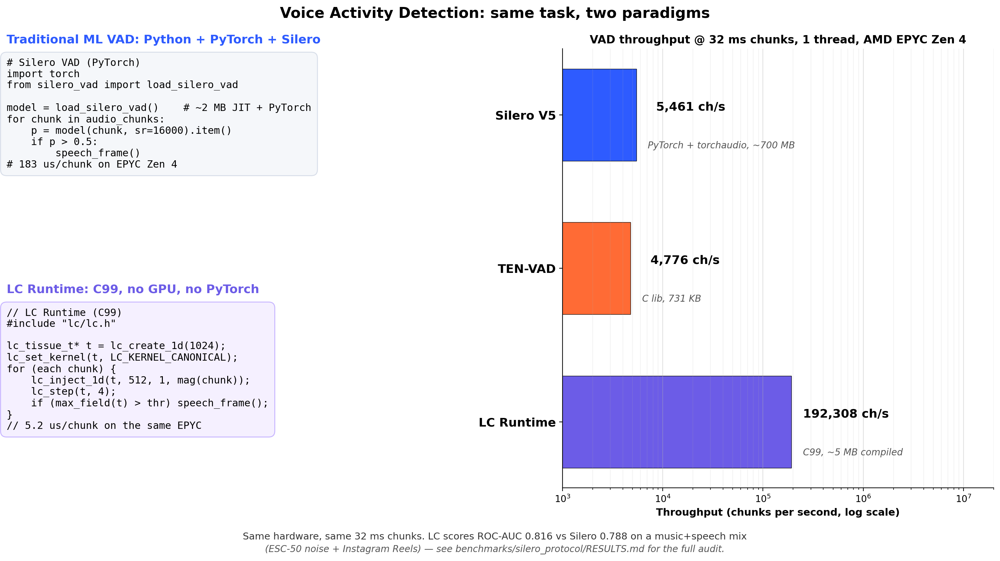

# LC Runtime — Local Coherence



**LC Runtime** is a CPU-native engine for local-propagation inference over a
continuous tissue of integer cells. **Local Coherence** is the paradigm it
implements: instead of carrying a model and running it over every input, the
runtime treats memory as a substrate where each entity (sensor, IP, frame,
event) is a cell that evolves under a fixed local rule. Stable regions are
*frozen* at zero cost; only the active front does work.

C99 library, ~5 MB compiled, uint16 fixed-point, deterministic, and
**bit-exact across architectures** (Zen 2 Windows ↔ Zen 4 Linux, byte for
byte). No GPU, no PyTorch, no ONNX. On a music+speech mix, LC Runtime
processes **192 K chunks per second** at ROC-AUC 0.82, against 5 K ch/s
at 0.79 for Silero on the same EPYC Zen 4 (single thread).

[Source on GitHub →](https://github.com/bracoTuxbr/local-coherence) ·
[Read the paper →](https://github.com/bracoTuxbr/local-coherence/blob/main/paper/preprint.md) ·
[Python binding →](https://github.com/bracoTuxbr/lcruntime-python)

## The principle

Under a strictly local kernel with finite spread, the per-step cost is
proportional to the **active region**, not the whole field. This is the
**Differential Activity Principle (PAD)**. The companion paper formalizes
and validates it across 18 reproducible experiments on a 15-watt mobile CPU.

## What you get

| Property | Measurement |
|---|---|
| Bit-exact between Zen 2 (Windows MinGW) and Zen 4 (Linux gcc 13.3) | byte-for-byte field identity |
| Speedup of dirty + freeze vs naive dense kernel | **520× median** on sparse perturbations |
| Sustained throughput regardless of working set (4 KB to 64 MB) | **10–12 GB/s** (bandwidth-bound) |
| Compiled library size | **5 MB**, single C99 header |
| Dependencies | none (no PyTorch, no ONNX, no GPU) |

## 30 seconds in code

```c
#include "lc/lc.h"
#include <stdio.h>

int main(void) {
    lc_tissue_t* t = lc_create_1d(1024);
    if (!t) return 1;

    lc_set_kernel(t, LC_KERNEL_CANONICAL);
    lc_set_sig_delta(t, 4);

    lc_inject_1d(t, 512, 1, 30000);
    lc_step(t, 100);

    printf("active cells: %zu  r_eff: %zu\n",
           lc_active_count(t), lc_r_eff(t));

    lc_destroy(t);
    return 0;
}
```

Python users — see the separate
[`lcruntime-python`](https://github.com/bracoTuxbr/lcruntime-python)
repo for the pip-installable wrapper.

## Documentation

- [Paradigm in four layers](paradigm) — 5 words / 1 sentence / 1 paragraph / technical
- [Architecture](architecture) — runtime / application boundary, public C API, repository layout
- [Embedding guide](embedding-guide) — practical patterns and anti-patterns
- [Applications](applications) — where LC wins, where it loses, plus untested ideas worth exploring

## Honest positioning

LC is **not** a universal champion. The applications page documents 4 validated wins,
4 honest losses, and a set of untested domains where LC's properties suggest a fit.
If your problem has the locality + sparsity structure described in the paper, LC is
worth trying. If not, the page tells you which tool to use instead.

## Citing

```bibtex
@misc{alencar2026localcoherence,
  title  = {Local Coherence: empirical validation of the Differential
            Activity Principle on a 15-watt mobile CPU},
  author = {Alencar, Thiago},
  note   = {Implementation and experiments developed with Anthropic Claude
            (Opus 4.6 / 4.7); see AUTHORS.md for full provenance.},
  year   = {2026},
  url    = {https://github.com/bracoTuxbr/local-coherence}
}
```

## License

Apache 2.0 — see
[LICENSE](https://github.com/bracoTuxbr/local-coherence/blob/main/LICENSE).
